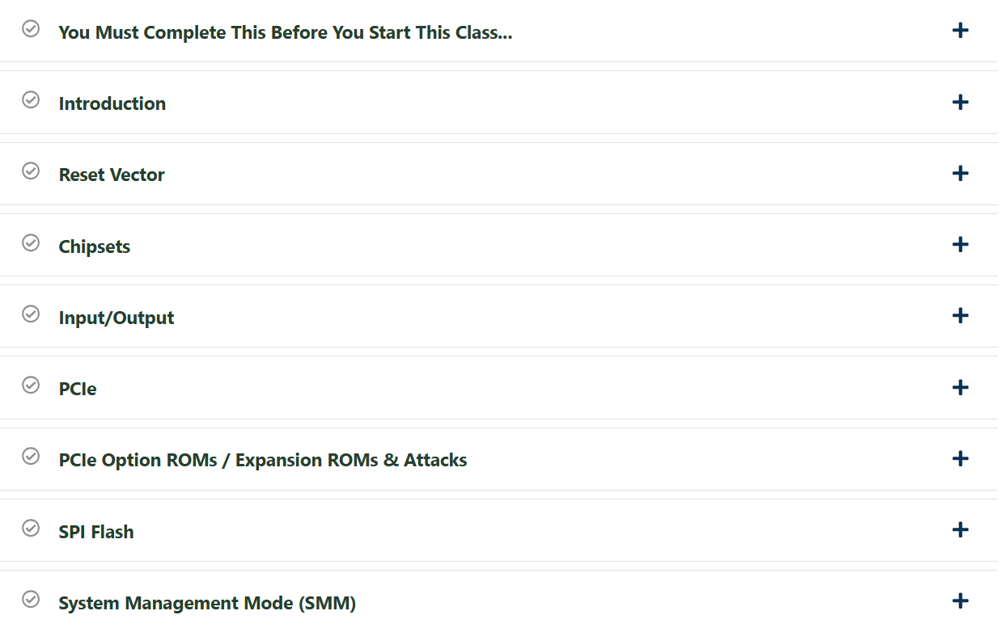
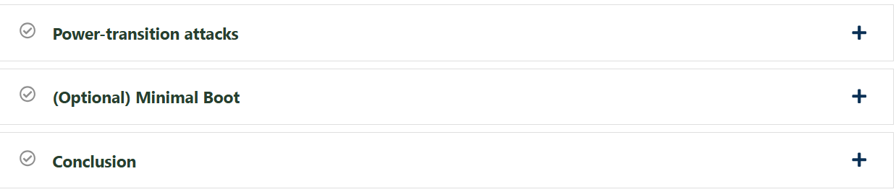
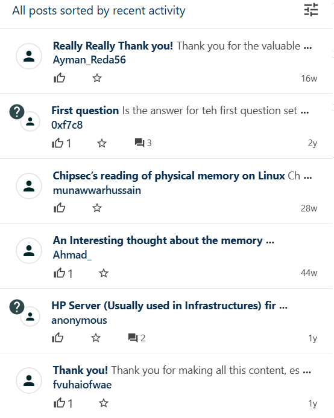
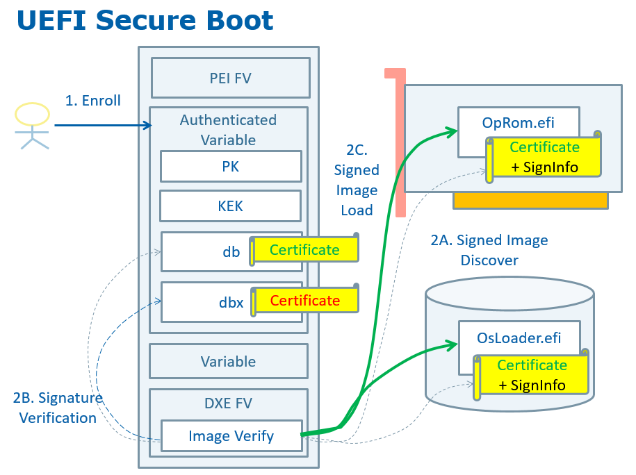

# 🔐 Architecture 4001 – Intel Firmware Attack & Defense

This repository contains structured notes, diagrams, checklists, extra references, and a certificate of completion for the **Architecture 4001 – x86-64 Intel Firmware Attack & Defense** course.  
It aims to serve as a **community knowledge base** for both Red Team & Blue Team learners.

---

## 📚 Notes (Modules)

- 📄 [`01-uefi-basics.md`](./notes/01-uefi-basics.md) – UEFI boot fundamentals  
- 📄 [`02-spi-flash.md`](./notes/02-spi-flash.md) – SPI flash memory & firmware storage  
- 📄 [`03-intel-me.md`](./notes/03-intel-me.md) – Intel Management Engine  
- 📄 [`04-smm.md`](./notes/04-smm.md) – System Management Mode (SMM)  
- 📄 [`05-boot-guard-txt.md`](./notes/05-boot-guard-txt.md) – Boot Guard & Trusted Execution  
- 📄 [`06-hardening.md`](./notes/06-hardening.md) – Firmware security hardening  

---

## 📋 Checklists & Security Guides

- ✅ [`firmware-hardening.md`](./content/checklists/firmware-hardening.md) – Practical hardening checklist  
- 🛡️ [`platform-security-controls.md`](./content/blue-team/platform-security-controls.md) – Blue Team perspective  
- 🎯 [`threat-modeling-only.md`](./content/red-team/threat-modeling-only.md) – Red Team threat modeling concepts  

---

## 📂 Documentation

- 📑 [`syllabus.md`](./docs/syllabus.md) – Course syllabus overview  
- 🛠️ [`roadmap.md`](./docs/roadmap.md) – Suggested learning path  
- 📖 [`glossary.md`](./docs/glossary.md) – Terminology explained  
- 📚 [`references.md`](./docs/references.md) – Research papers & references  

---

## 📊 Extras

- 🕒 [`timeline.md`](./extras/timeline.md) – Evolution of firmware attacks & defenses  
- 📂 [`case-studies.md`](./extras/case-studies.md) – Real-world case studies  
- 📘 [`resources.md`](./extras/resources.md) – Extended resources  

---

## 📸 Screenshots

| Step                  | Screenshot |
|-----------------------|------------|
| 📘 Course – Part I    |  |
| 📘 Course – Part II   |  |
| 💬 Discussions        |  |

---

## 🖼️ Diagrams

| Diagram | Preview |
|---------|---------|
| 🔧 UEFI Boot Flow |  |

---

## 📜 Certificate

🎓 [`Architecture 4001 – Intel Firmware Attack & Defense`](./cert/Architecture%204001%20x86-64%20Intel%20Firmware%20Attack%20%26%20Defense.png)

---

## ✍️ Author

**Thành Danh** – Red Team Learner | Pentester & Security Researcher  
GitHub: [@ngvuthdanhh](https://github.com/ngvuthdanhh)  
Email: **ngvu.thdanh@gmail.com**

---

## 📄 License

This project is licensed under the terms of the **MIT License**.  
See [`LICENSE`](./LICENSE) for details.

© 2025 ngvuthdanhh. All rights reserved.
